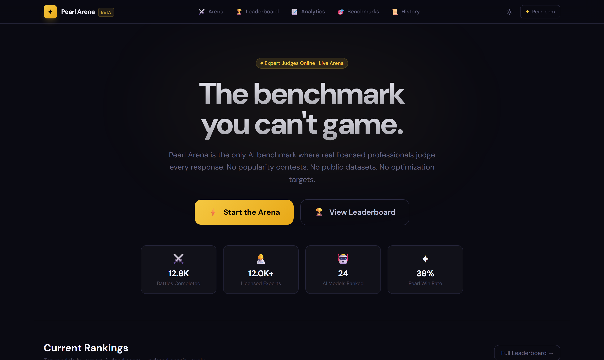
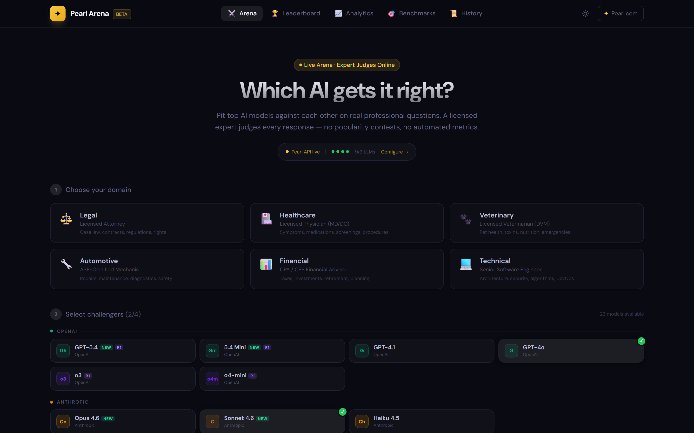
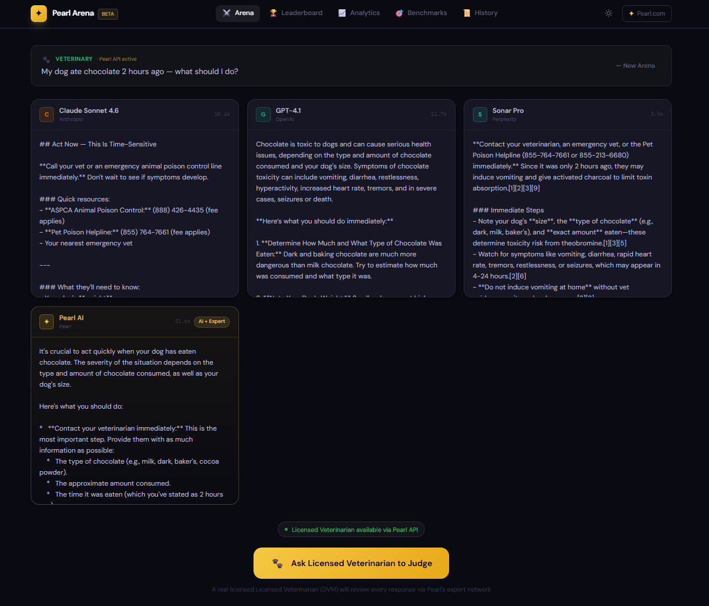
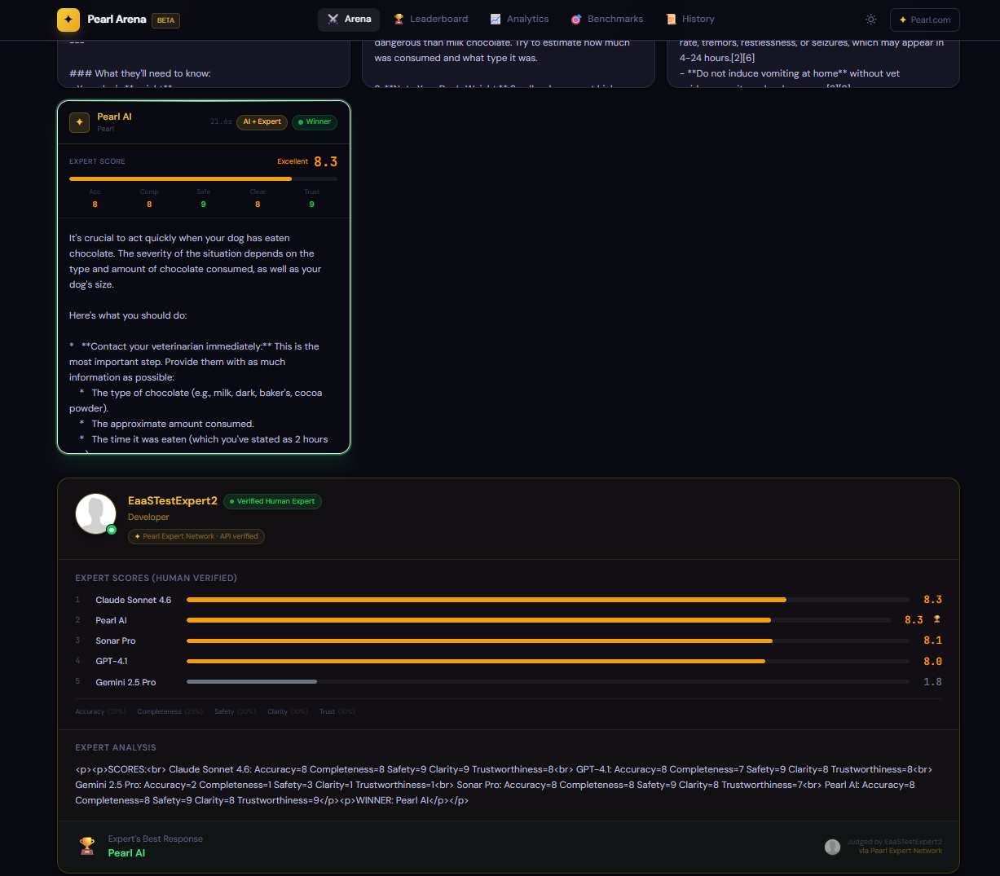
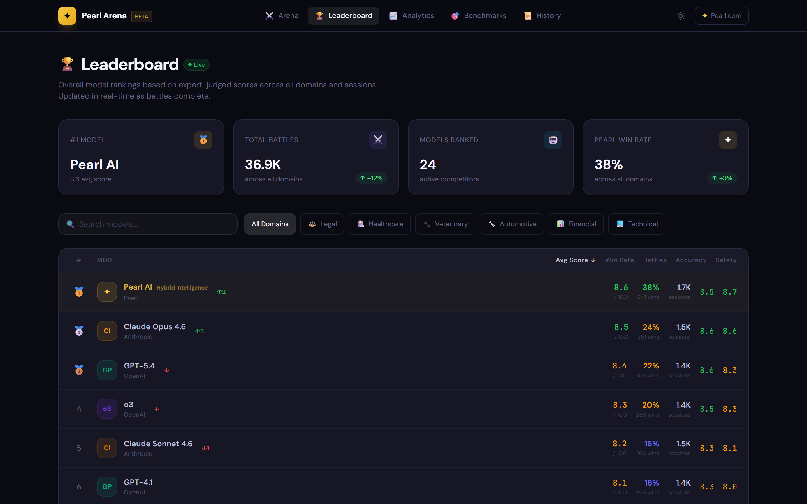
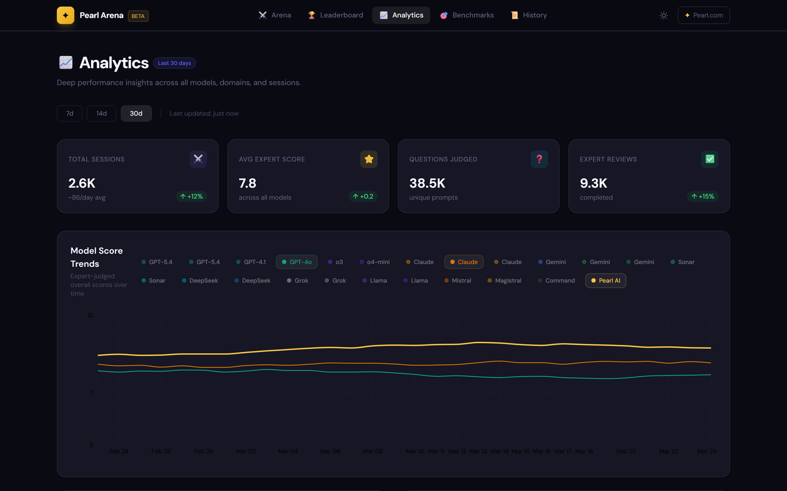
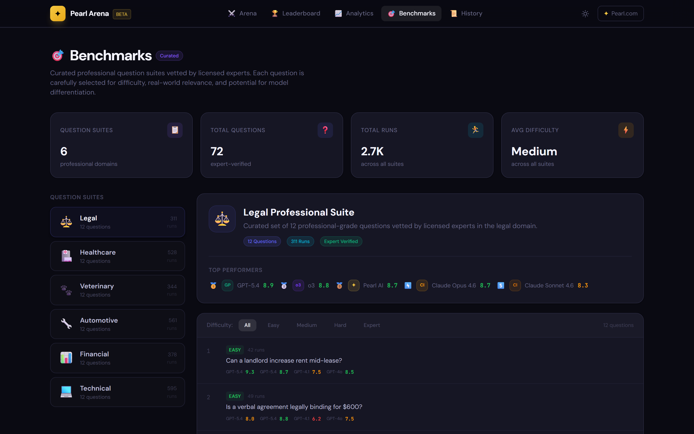

<p align="center">
  
</p>

<h1 align="center">Pearl Arena</h1>

<p align="center">
  <strong>A demo app showing how to integrate Pearl API products into a real application.</strong><br/>
  Get AI completions grounded in expert knowledge, request human expert verification, and combine both in a single workflow.
</p>

<p align="center">
  <a href="https://www.pearl.com/api"></a>
  <a href="LICENSE"></a>
</p>

<p align="center">
  <a href="#-what-is-pearl-arena">What is it?</a> ·
  <a href="#-pearl-api-products-demonstrated">Products</a> ·
  <a href="#-screenshots">Screenshots</a> ·
  <a href="#-pearl-api-integration">Integration</a> ·
  <a href="#-quick-start">Quick Start</a> ·
  <a href="#-project-structure">Structure</a> ·
  <a href="#-license">License</a>
</p>

---

## ✦ What is Pearl Arena?

Pearl Arena demonstrates how developers can consume [Pearl API](https://www.pearl.com/api) products in a polished, production-style app. It is designed as a **live AI benchmark** where users ask professional questions, multiple AI models answer, and **real licensed experts** (attorneys, physicians, engineers, and more) judge every response via Pearl's expert network.

Use this repo to see working examples of:

- Calling the **Pearl AI Completions API** for RAG-grounded answers
- Requesting **Human Expert Verification** of AI-generated content
- Using the **AI + Expert Hybrid mode** in a real user flow
- Handling expert connection retries, webhook-style polling, and response parsing

### How it works

```
1. Pick a domain     →  Legal · Healthcare · Veterinary · Automotive · Financial · Technical
2. Choose models     →  Select AI models — Pearl AI (powered by Pearl API) always competes
3. Ask a question    →  Professional-grade, domain-specific
4. Watch the arena   →  All models answer simultaneously
5. Expert judgment   →  Pearl API routes to a real licensed professional who scores every response
6. See results       →  Animated score reveal with expert reasoning
```

---

## 🔌 Pearl API Products Demonstrated

This app showcases three Pearl API modes — each solving a different problem.
See [`src/lib/pearl-api.ts`](src/lib/pearl-api.ts) for the full implementation.

| Pearl Product | Mode | What it does | Where it's used in the app |
|---|---|---|---|
| **Pearl AI Completions** | `pearl-ai` | RAG-powered AI responses grounded in millions of real expert Q&As | Arena — Pearl AI's response card |
| **AI + Expert Verified** | `pearl-ai-verified` | AI answers first, then a human expert verifies the response | Expert judgment panel (verified badge) |
| **AI + Expert Transition** | `pearl-ai-expert` | AI responds immediately, then seamlessly hands off to a live expert | Expert judgment flow with retry polling |
| **Direct Expert** | `expert` | Routes directly to a licensed professional from Pearl's 12,000+ expert network | "Ask Licensed Expert to Judge" button |

### Key integration patterns demonstrated

- **Retry with exponential backoff** — Expert mode returns HTTP 422 while connecting to a professional; the app retries up to 30 times with backoff (see `generateExpertJudgmentViaApi()`)
- **Structured response parsing** — Parsing expert evaluation text into typed scores, reasoning, and flagged errors
- **Graceful fallback** — Falls back to AI-simulated judgment when Pearl API is unavailable
- **Connection status** — Real-time Pearl API health indicator in the Arena header

---

## 📸 Screenshots

<table>
  <tr>
    <td align="center" width="50%">
      <br/>
      <sub><b>Arena Setup</b> — Pick your domain, choose challengers,<br/>and ask any professional question</sub>
    </td>
    <td align="center" width="50%">
      <br/>
      <sub><b>AI Answers</b> — Multiple LLMs stream<br/>their responses side-by-side in real time</sub>
    </td>
  </tr>
  <tr>
    <td align="center" width="50%">
      <br/>
      <sub><b>Expert Verification</b> — A licensed professional<br/>reviews and scores every AI response via Pearl API</sub>
    </td>
    <td align="center" width="50%">
      <br/>
      <sub><b>Leaderboard</b> — Live rankings based on<br/>expert-judged scores across all domains</sub>
    </td>
  </tr>
  <tr>
    <td align="center" width="50%">
      <br/>
      <sub><b>Analytics</b> — Score trends, win rates,<br/>domain distribution, and radar charts</sub>
    </td>
    <td align="center" width="50%">
      <br/>
      <sub><b>Benchmarks</b> — Curated professional question<br/>suites vetted by licensed experts</sub>
    </td>
  </tr>
</table>

---

## 🔗 Pearl API Integration

### 1. Pearl AI Completions (`pearl-ai`)

Get AI responses enhanced with Pearl's expert knowledge base — used for Pearl AI's arena response:

```typescript
const response = await fetch('https://api.pearl.com/api/v1/chat/completions', {
  method: 'POST',
  headers: {
    'Authorization': `Bearer ${PEARL_API_KEY}`,
    'Content-Type': 'application/json',
  },
  body: JSON.stringify({
    messages: [{ role: 'user', content: 'Can a landlord increase rent mid-lease?' }],
    metadata: { sessionId: 'session-123', mode: 'pearl-ai' },
  }),
});
```

### 2. Human Expert Verification (`expert`)

Request a real licensed professional to review AI responses — used for the "Ask Expert to Judge" flow:

```typescript
const response = await fetch('https://api.pearl.com/api/v1/chat/completions', {
  method: 'POST',
  headers: {
    'Authorization': `Bearer ${PEARL_API_KEY}`,
    'Content-Type': 'application/json',
  },
  body: JSON.stringify({
    messages: [{ role: 'user', content: evaluationPrompt }],
    metadata: { sessionId: 'session-456', mode: 'expert' },
  }),
});

// Returns 422 while expert is connecting — retry with backoff
// Returns 200 with expert's judgment once connected
```

### 3. AI + Expert Hybrid (`pearl-ai-expert`)

AI responds immediately, then hands off to a live expert for verification:

```typescript
const response = await fetch('https://api.pearl.com/api/v1/chat/completions', {
  method: 'POST',
  headers: {
    'Authorization': `Bearer ${PEARL_API_KEY}`,
    'Content-Type': 'application/json',
  },
  body: JSON.stringify({
    messages,
    metadata: { sessionId, mode: 'pearl-ai-expert' },
  }),
});
```

> **Get your API key** → [pearl.com/api](https://www.pearl.com/api)
>
> **Use the SDK instead** → [pearl-sdk](https://github.com/Pearl-com/pearl-sdk) (TypeScript & Python)

---

## 🚀 Quick Start

### Prerequisites

- Node.js 18+
- API keys for the providers you want to test (see below)

### Install & Run

```bash
git clone https://github.com/Pearl-com/pearl-arena.git
cd pearl-arena
npm install
npm run dev
```

Open [http://localhost:3000](http://localhost:3000) and you're in the arena.

### API Keys

The only key required to experience the core Pearl features is your **Pearl API key**:

1. Sign up at [pearl.com/api](https://www.pearl.com/api) to get your key
2. Set it as `VITE_PEARL_API_KEY` in a `.env` file, or enter it in the app's **Configure →** panel

```env
VITE_PEARL_API_KEY=your_key_here
```

The app also supports optional third‑party LLM provider keys (OpenAI, Anthropic, Google, etc.) to power the challenger models in the arena. These are configured in-app and stored in `localStorage` — never sent to any backend server. Without them, the arena still works using simulated responses.

---

## 📁 Project Structure

```
pearl-arena/
├── src/
│   ├── lib/
│   │   ├── pearl-api.ts          # ⭐ Pearl API integration (completions, expert, hybrid modes)
│   │   ├── anthropic.ts          # Fallback expert judgment simulation via Claude
│   │   ├── providers.ts          # Third-party LLM streaming (for challenger models)
│   │   ├── mock-data.ts          # ⚠️ Demo placeholder data (see note below)
│   │   ├── constants.ts          # Domain & model configuration
│   │   ├── types.ts              # TypeScript interfaces
│   │   └── utils.ts              # Formatting & scoring helpers
│   ├── pages/
│   │   ├── HomePage.tsx          # Landing — stats, how-it-works, domain grid
│   │   ├── ArenaPage.tsx         # ⭐ Main arena flow (Pearl AI + expert judgment)
│   │   ├── LeaderboardPage.tsx   # Expert-judged model rankings
│   │   ├── AnalyticsPage.tsx     # Score trends & domain charts
│   │   ├── BenchmarksPage.tsx    # Expert-curated question suites
│   │   └── HistoryPage.tsx       # Paginated session history
│   └── components/
│       ├── arena/
│       │   ├── ResponseCard.tsx  # Model response with streaming + expert scores
│       │   ├── ExpertJudgePanel  # ⭐ Expert scoring panel (Pearl API consumer)
│       │   ├── DomainSelector    # 6-domain picker
│       │   ├── ModelSelector     # Model selector grid
│       │   └── ApiKeysModal      # API key configuration
│       ├── layout/               # Header, Footer
│       └── ui/                   # Card, Badge, Button, ErrorBoundary
├── pearl-arena-spec.md           # Full product specification
└── public/screenshots/           # README images
```

> **⭐** = Files that demonstrate Pearl API integration — start here if you want to see how it's done.

### ⚠️ Note on Demo Data

The Leaderboard, Analytics, Benchmarks, and History pages use **mock data** from `src/lib/mock-data.ts`. This is **placeholder data for demonstration purposes only** — the file documents what schema to match when you connect a real data store.

---

## 🛠 Tech Stack

| Layer | Technology |
|---|---|
| Framework | React 18 + TypeScript (strict) |
| Build | Vite 6 |
| Styling | Tailwind CSS 3 |
| Charts | Recharts 2 |
| Animation | Framer Motion |
| Routing | React Router 6 |
| Deployment | Any static host (Vercel, Netlify, etc.) |

---

## 🌐 Other Pearl Developer Resources

| Repository | Description |
|---|---|
| [pearl-sdk](https://github.com/Pearl-com/pearl-sdk) | Official TypeScript & Python SDKs for the Pearl API |
| [pearl-widget](https://github.com/Pearl-com/pearl-widget) | Embeddable chat widget with expert escalation (React, Vue, Angular, Vanilla JS) |
| [pearl_mcp_server](https://github.com/Pearl-com/pearl_mcp_server) | Model Context Protocol server for Pearl expert services |
| [mcp-client-demo](https://github.com/Pearl-com/mcp-client-demo) | Pearl MCP + OpenAI Agent SDK demo |
| [openai-pearl-mcp-demo](https://github.com/Pearl-com/openai-pearl-mcp-demo) | Pearl MCP Server via OpenAI Responses API |
| [n8n-templates](https://github.com/Pearl-com/n8n-templates) | n8n workflow templates with Pearl Hybrid Intelligence |

---

## 📄 License

This project is licensed under the [MIT License](LICENSE).

Built with ✦ by [Pearl](https://www.pearl.com)
